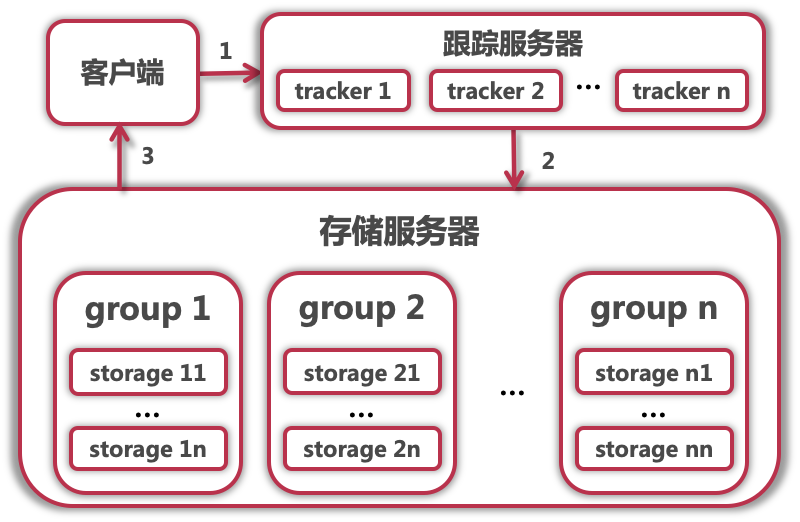
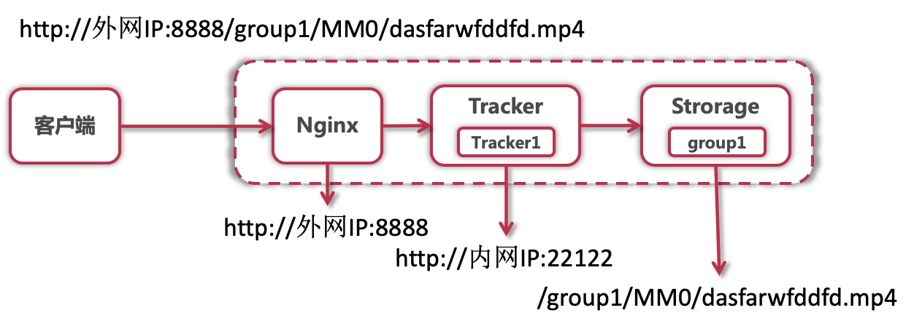

# 四、视频与弹幕功能开发

## 4.1 概要

使用`FastDFS`文件服务器搭建文件存储服务、以及相关工具类开发。

相关功能开发：

- 视频上传、视频处理、视频获取、视频在线播放、视频下载
- 弹幕系统、数据统计、社交属性（点赞、投币、收藏、评论）


## 4.2 FastDFS文件服务器

`FastDFS`是开源的轻量级分布式文件系统，用于解决大数据量存储和负载均衡等问题。

优点：支持HTTP协议传输文件（结合Nginx）；对文件内容做Hash处理，节约磁盘空间；支持负载均衡、整体性能较佳，适用于中小型系统。


`FastDFS`的两个角色：跟踪服务器(Tracker)、存储服务器(Storage)。

- 跟踪服务器：主要做调度工作，起到负载均衡的作用。它是客户端和存储服务器交互的枢纽。

- 存储服务器：主要提供容量和备份服务，存储服务器是以组（Group）为单位，每个组内可以有多台存储服务器，数据互为备份。文件及属性（Meta Data）都保存在该服务器上。

- `FastDFS 架构图`

  


## 4.3 Nginx

> `Nginx`是反向代理服务器。代理其实就是中间人，客户端通过代理发送请求到互联网上的服务器，从而获取想要的资源。

主要用途：反向代理、负载均衡

主要特点：跨平台、配置简单易上手、高并发、内存消耗小、稳定性高


- 正向代理的特点：服务端不知道客户端、客户端知道代理端

  

- 反向代理的特点：服务端知道客户端、客户端不知道代理端

  


Nginx结合FastDFS实现文件资源HTTP访问：




## 4.4 部署FastDFS和Nginx

### 4.4.1 安装 FastDFS

下载安装参考：https://github.com/happyfish100/fastdfs/wiki

1. 使用命令：`cat /etc/redhat-release`，查看`CentOS`版本（需要7.x版本）

2. 执行编译环境指令

   ```sh
   yum install git gcc-c++ make automake autoconf libtool pcre pcre-devel zlib zlib-devel openssl-devel wget vim -y
   ```

3. 新建`/home/dfs/`目录用来存储数据；切换到`/usr/local/src`下

   ```bash
   mkdir /home/dfs
   cd /usr/local/src
   ```

4. 下载`libfastcommon`，使用`git clone`命令：

   ```sh
   git clone https://github.com/happyfish100/libfastcommon.git --depth
   ```

5. 将下载好的包放在`/usr/local/src`下

6. 使用命令cd进入解压后的文件夹

7. 执行`./make.sh && ./make.sh install`进行编译安装

8. 安装`libfastcommon`完成后，继续安装`FastDFS`，依然可以使用命令

   ```sh
   git clone https://github.com/happyfish100/fastdfs.git --depth 1
   ```

9. 下载`FastDFS`完成后，流程同`libfastcommon`，进入相应的文件夹执行编译

10. 准备`FastDFS`配置文件，执行以下命令

    ```sh
    cp /usr/local/src/fastdfs/conf/http.conf /etc/fdfs/ #供nginx访问使用
    cp /usr/local/src/fastdfs/conf/mime.types /etc/fdfs/ #供nginx访问使用
    ```

11. 安装fastdfs-nginx-module

    ```sh
    cd ../ #返回上一级目录
    git clone https://github.com/happyfish100/fastdfs-nginx-module.git --depth 1
    cp /usr/local/src/fastdfs-nginx-module/src/mod_fastdfs.conf /etc/fdfs
    ```


### 4.4.2 安装 Nginx

```sh
wget http://nginx.org/download/nginx-1.15.4.tar.gz #下载nginx压缩包
tar -zxvf nginx-1.15.4.tar.gz #解压
cd nginx-1.15.4/
#添加fastdfs-nginx-module模块
./configure --add-module=/usr/local/src/fastdfs-nginx-module/src/ 
make && make install #编译安装
```


### 4.4.3 单机部署

#### tracker配置

```sh
#服务器ip为 192.168.52.1
#我建议用ftp下载下来这些文件 本地修改
vim /etc/fdfs/tracker.conf
#需要修改的内容如下
port=22122  # tracker服务器端口（默认22122,一般不修改）
base_path=/home/dfs  # 存储日志和数据的根目录
```


#### storage配置

```sh
vim /etc/fdfs/storage.conf
#需要修改的内容如下
port=23000  # storage服务端口（默认23000,一般不修改）
base_path=/home/dfs  # 数据和日志文件存储根目录
store_path0=/home/dfs  # 第一个存储目录
tracker_server=192.168.52.1:22122  # tracker服务器IP和端口
http.server_port=8888  # http访问文件的端口(默认8888,看情况修改,和nginx中保持一致)
```


#### 运行

```sh
/etc/init.d/fdfs_trackerd start #启动tracker服务
chkconfig fdfs_trackerd on #自启动tracker服务
/etc/init.d/fdfs_storaged start #启动storage服务
chkconfig fdfs_storaged on #自启动storage服务
```


#### client配置

```sh
vim /etc/fdfs/client.conf
#需要修改的内容如下
base_path=/home/dfs
tracker_server=192.168.52.1:22122    #tracker服务器IP和端口
```


#### client测试

```sh
# 保存后测试,返回ID表示成功 如：group1/M00/00/00/xx.tar.gz
fdfs_upload_file /etc/fdfs/client.conf /usr/local/src/nginx-1.15.4.tar.gz
```


#### 配置nginx访问

```sh
vim /etc/fdfs/mod_fastdfs.conf
#需要修改的内容如下
tracker_server=192.168.52.1:22122  #tracker服务器IP和端口
url_have_group_name=true
store_path0=/home/dfs
#配置nginx.config
vim /usr/local/nginx/conf/nginx.conf
#在http中添加如下配置
server {
    listen       8888;    ## 该端口为storage.conf中的http.server_port相同
    server_name  localhost;
    location ~/group[0-9]/ {
        ngx_fastdfs_module;
    }
    error_page   500 502 503 504  /50x.html;
    location = /50x.html {
    root   html;
    }
}
#测试下载，用外部浏览器访问刚才已传过的nginx安装包,引用返回的ID
http://192.168.52.1:8888/group1/M00/00/00/wKgAQ1pysxmAaqhAAA76tz-dVgg.tar.gz
#弹出下载单机部署全部跑通
```


#### 项目启动

##### 防火墙

```sh
# 不关闭防火墙的话无法使用
systemctl stop firewalld.service #关闭
systemctl restart firewalld.service #重启
```

##### tracker

```sh
/etc/init.d/fdfs_trackerd start #启动tracker服务
/etc/init.d/fdfs_trackerd restart #重启动tracker服务
/etc/init.d/fdfs_trackerd stop #停止tracker服务
chkconfig fdfs_trackerd on #自启动tracker服务
```

##### storage

```sh
/etc/init.d/fdfs_storaged start #启动storage服务
/etc/init.d/fdfs_storaged restart #重动storage服务
/etc/init.d/fdfs_storaged stop #停止动storage服务
chkconfig fdfs_storaged on #自启动storage服务
```

##### nginx

```sh
/usr/local/nginx/sbin/nginx #启动nginx
/usr/local/nginx/sbin/nginx -s reload #重启nginx
/usr/local/nginx/sbin/nginx -s stop #停止nginx
```


## 4.5 在项目中引入FastDFS依赖

在pom文件中引入

```xml
<!-- FastDFS 依赖 -->
<dependency>
    <groupId>com.github.tobato</groupId>
    <artifactId>fastdfs-client</artifactId>
    <version>1.27.2</version>
</dependency>
```


在util包中编写工具类`FastDFSUtil`


## 4.6 断点续传

大文件上传一般会有以下问题：

- 文件过大占用带宽，会造成响应速度下降
- 上传过程如果出现网络故障等问题，会导致上传失败，特别是1G文件上传到1023M的时候失败，突然要重新上传，想想就刺激。


断点：上传过程中出现暂停、中断等情况。


解决方案：

将大文件分片，将大文件拆分成很多小文件分片，上传的时候按顺序一个个上传，如果上传过程出现断点，假设大文件被拆分成20个文件分片，此时如果上传了9个，在第10个分片出现了中断，那么我们只需要重新从第10个分片开始上传就可以了。


在`AppendFileStorageClient`中有断点续传相关功能，但是使用的时候一般不用`appendFile()`这个方法，因为它会追加到文件后面，如果一直重复追加会破坏原本的文件，所以用的时候使用`modifyFile()`修改续传文件内容是比较好的。


需要一个文件的MD5。

对文件进行MD5加密获取唯一标识，用来实现秒传。

需要一个完整的断点续传方法，借助redis记录临时的key-value。


## 4.7 文件分片

