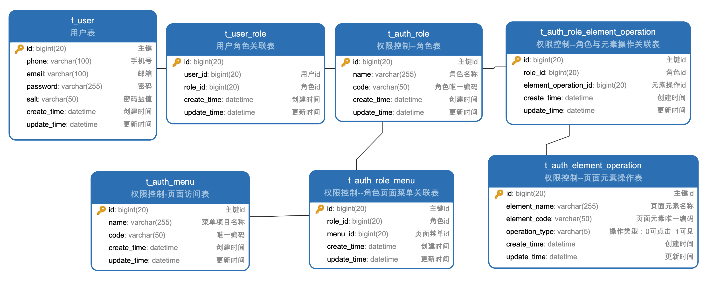

# 在线视频播放网站

## 三、用户模块开发

### 3.1 接口设计

接口设计使用`RESTful风格`：RESTful架构、HTTP方法语义、HTTP方法幂等性、RESTful接口设计原则。

#### 3.1.1 RESTful接口

`REST`全称是`Representational State Transfer`，中文是表述性状态转移，REST指的是 ==一组架构约束条件和原则==。

`RESTful`表述的是资源的状态性转移，在 Web 中资源就是`URI (Uniform Resource Identifier)`。

如果一个架构符合`REST`的约束条件和原则，我们就称它为`RESTful 架构`，`HTTP`是目前与`REST`相关的唯一实例。

`RESTful`架构应该遵循统一的接口原则，应该使用标准的`HTTP`方法如`GET`和`POST`，并且遵循这些方法的语义。


#### 3.1.2 HTTP方法的语义

|  方法  | 语义                                                         |
| :----: | :----------------------------------------------------------- |
|  GET   | 获取指定的资源                                               |
|  POST  | 发送数据给服务器，依据`HTTP 1.1规范`中的描述，结合实际项目开发经验，POST经常为了以统一的方法来涵盖以下功能：<br />（1）在公告板，新闻组，邮件列表或类似的文章组中发布消息；<br />（2）通过注册新增用户；<br />（3）向数据处理程序提供一批数据，例如提交一个表单。 |
|  PUT   | 使用请求中的负载（载荷）创建或者替换目标资源。`PUT`和`POST`的区别在于`PUT 是幂等的`，而`POST 不是`。幂等的含义可以理解为调用一次与连续调用多次是等价的（没有副作用或副作用不变） |
| DELETE | 删除指定的资源                                               |


#### 3.1.3 POST和PUT的区别

`POST`请求和`PUT`的区别容易被简单地误认为：`POST 表示创建资源，PUT 表示更新资源`。

实际上，二者都可以用于创建资源，更为本质的差别是在幂等性方面。


#### 3.1.4 HTTP的幂等性

|  方法  |    幂等性    | 幂等性分析                                                   |
| :----: | :----------: | :----------------------------------------------------------- |
|  GET   |  具备幂等性  | 用于获取资源，没有副作用，所以是幂等的。这里强调的是一次和 N 次并不是说每次请求的结果相同，而是每次请求不会产生不同的副作用。 |
| DELETE |  具备幂等性  | 用于删除资源，有副作用，但它应该满足幂等性，调用一次和 N 次对系统产生的副作用是相同的 |
|  POST  | 不具备幂等性 | POST 所指向资源`并非 POST 要创建的资源本身`，而`是 POST 创建资源的接收者`，比如`POST:/news`的含义是在`news`新闻组这个资源分类下新建一条新的新闻，所以两次==相同==的 POST 请求`会在服务器端创建两份新的资源`，它们是不同的。所以，POST方法不具备幂等性 |
|  PUT   |  具备幂等性  | PUT对应的资源是要创建或更新的资源本身，语义是创建或更新，对`同一资源进行多次 PUT 的副作用和一次 PUT 是相同的`，因此，PUT方法具有幂等性 |


RESTful接口测试

```java
package com.ataraxia.controller;

import org.springframework.web.bind.annotation.*;

import java.util.Arrays;
import java.util.HashMap;
import java.util.Map;

/**
 * @author Ataraxia
 * @create 2022/4/20 23:08
 * @description 接口测试
 */

@RestController
public class RESTfulController {

    private final Map<Integer, Map<String, Object>> dataMap;

    public RESTfulController() {
        dataMap = new HashMap<>();
        for (int i = 1; i < 3; i++) {
            Map<String, Object> data = new HashMap<>();
            data.put("id", i);
            data.put("name", "name" + i);
            dataMap.put(i, data);
        }
    }

    @GetMapping("objects/{id}")
    public Map<String, Object> getData(@PathVariable Integer id) {
        return dataMap.get(id);
    }

    @DeleteMapping("objects/{id}")
    public String deleteData(@PathVariable Integer id) {
        dataMap.remove(id);
        return "delete success！";
    }

    @PostMapping("objects")
    public String postData(@RequestBody Map<String, Object> data) {
        Integer[] idArrays = dataMap.keySet().toArray(new Integer[0]);
        Arrays.sort(idArrays);
        int nextId = idArrays[idArrays.length - 1] + 1;
        dataMap.put(nextId, data);
        return "post success！";
    }

    @PutMapping("objects")
    public String putData(@RequestBody Map<String, Object> data) {
        Integer id = Integer.valueOf(String.valueOf(data.get("id")));
        Map<String, Object> containedData = dataMap.get(id);
        if (containedData == null) {
            Integer[] idArrays = dataMap.keySet().toArray(new Integer[0]);
            Arrays.sort(idArrays);
            int nextId = idArrays[idArrays.length - 1] + 1;
            dataMap.put(nextId, data);
        } else {
            dataMap.put(id, data);
        }
        return "put success！";
    }
}
```


#### 3.1.5 RESTful接口和URL命名原则

1. HTTP方法后跟的URL必须是名词且统一成名词复数形式。
2. URL中不采用大小写混合的驼峰命名，尽量采用全小写单词，如果需要连接多个单词，则采用`-`连接。
3. 示例：`/users`、`/users-fans`；反例：`/getUsers`、`/getUsersFans`


#### 3.1.6 RESTful接口和URL分级原则

1. 一级用来定位资源分类，如`/users`即表示需要定位到用户相关资源。
2. 二级仍用来定位具体某个资源，如`/users/20`即表示 id 为 20 的用户，再如`/users/20/fans/1`即表示 id 为 20 的用户的 id 为 1 的粉丝。

> `Tips`：原则是为了让我们的开发更加规范，但是不能成为束缚我们开发的枷锁！


#### 3.1.7 RESTful接口命名示例

`GET`、`POST`、`PUT`、`DELETE`接口命名示例

|     URI     |  方法  |         功能         |
| :---------: | :----: | :------------------: |
|  `/users`   |  GET   |     获取用户列表     |
| `/users/20` |  GET   | 获取 id 为 20 的用户 |
|  `/users`   |  POST  |       创建用户       |
| `/users/20` |  PUT   | 修改 id 为 20 的用户 |
|  `/users`   |  PUT   |     批量修改用户     |
| `/users/20` | DELETE | 删除 id 为 20 的用户 |


复杂`GET 请求`接口命名示例：

|                            URI                             | 方法 |        功能        |
| :--------------------------------------------------------: | :--: | :----------------: |
|                    `/users?gender=male`                    | GET  |        过滤        |
|              `/users?sort=created-time-desc`               | GET  |        排序        |
|        `/users?gender=male&sort=created-time-desc`         | GET  |    过滤 + 排序     |
| `/users?name=hellostar&gender=male&sort=created-time-desc` | GET  | 搜索 + 过滤 + 排序 |
|                 `/users?size=10&current=1`                 | GET  |        分页        |


### 3.2 通用功能与配置

#### 3.2.1 通用功能

##### 3.2.1.1 加解密工具（AES、RSA、MD5）

添加常用加解密工具依赖：

```xml
<!-- 加解密工具 -->
<dependency>
    <groupId>commons-codec</groupId>
    <artifactId>commons-codec</artifactId>
    <version>1.14</version>
</dependency>
```


AES工具类：

```java
import org.apache.tomcat.util.codec.binary.Base64;

import javax.crypto.Cipher;
import javax.crypto.KeyGenerator;
import javax.crypto.SecretKey;
import java.nio.charset.StandardCharsets;
import java.security.SecureRandom;

/**
 * @author Ataraxia
 * @create 2022/4/21 00:03
 * @description AES加密工具类
 * AES: Advanced Encryption Standard 高级加密标准
 * 最常见的对称加密算法，即加密和解密使用同样的密钥，加密结果可逆
 * 特点：加密速度非常快，适合经常发送数据的场合
 */
public class AESUtil {

    private static final String KEY_ALGORITHM = "AES";

    private static final char[] HEX_CHAR = {'0', '1', '2', '3', '4', '5', '6', '7', '8', '9', 'a', 'b', 'c', 'd', 'e', 'f'};

    private final Cipher decryptCipher;

    private final Cipher encryptCipher;

    private final String seed;

    public AESUtil(String seed) throws Exception {
        this.seed = seed;
        decryptCipher = Cipher.getInstance(KEY_ALGORITHM);
        encryptCipher = Cipher.getInstance(KEY_ALGORITHM);
        decryptCipher.init(Cipher.DECRYPT_MODE, this.getSecretKey());
        encryptCipher.init(Cipher.ENCRYPT_MODE, this.getSecretKey());
    }

    /**
     * 解密方法
     * @param content 待解密文本
     * @return 解密结果
     * @throws Exception exception
     */
    public String decrypt(String content) throws Exception {
        byte[] bytes = Base64.decodeBase64(content);
        byte[] result = decryptCipher.doFinal(bytes);
        return new String(result, StandardCharsets.UTF_8);
    }

    /**
     * 加密方法
     * @param content 待加密文本
     * @return 加密后的密文
     * @throws Exception exception
     */
    public String encrypt(String content) throws Exception {
        byte[] result = encryptCipher.doFinal(content.getBytes(StandardCharsets.UTF_8));
        return Base64.encodeBase64String(result);
    }

    public SecretKey getSecretKey() throws Exception {
        SecureRandom random = SecureRandom.getInstance("SHA1PRNG");
        random.setSeed(seed.getBytes());
        KeyGenerator kg = KeyGenerator.getInstance(KEY_ALGORITHM);
        kg.init(128, random);
        return kg.generateKey();
    }
}

```


MD5工具类：

```java
import org.apache.commons.codec.digest.DigestUtils;

import java.io.UnsupportedEncodingException;

/**
 * @author Ataraxia
 * @create 2022/4/21 00:06
 * @description MD5加密
 * 单向加密算法，加密后是不可逆的
 * 特点：加密速度快，不需要秘钥，但是安全性不高，需要搭配随机盐值使用
 */
public class MD5Util {

    /**
     * 加密方法
     * @param content 待加密文本
     * @param salt 随机盐
     * @param charset 字符编码
     * @return 加密后的文本
     */
    public static String sign(String content, String salt, String charset) {
        content = content + salt;
        return DigestUtils.md5Hex(getContentBytes(content, charset));
    }

    /**
     * 验证方法
     * @param content 待验证文本
     * @param sign 已加密过的文本
     * @param salt 随机盐
     * @param charset 字符编码
     * @return 比对结果
     */
    public static boolean verify(String content, String sign, String salt, String charset) {
        content = content + salt;
        String mySign = DigestUtils.md5Hex(getContentBytes(content, charset));
        return mySign.equals(sign);
    }

    private static byte[] getContentBytes(String content, String charset) {
        if (!"".equals(charset)) {
            try {
                return content.getBytes(charset);
            } catch (UnsupportedEncodingException var3) {
                throw new RuntimeException("MD5签名过程中出现错误，指定的编码集错误");
            }
        } else {
            return content.getBytes();
        }
    }
}

```


RSA工具类：

```java
import org.apache.commons.codec.binary.Base64;

import javax.crypto.Cipher;
import java.nio.charset.StandardCharsets;
import java.security.*;
import java.security.interfaces.RSAPrivateKey;
import java.security.interfaces.RSAPublicKey;
import java.security.spec.PKCS8EncodedKeySpec;
import java.security.spec.X509EncodedKeySpec;

/**
 * @author Ataraxia
 * @create 2022/4/21 00:07
 * @description RSA加密
 * 非对称加密，有公钥和私钥之分，公钥用于数据加密，私钥用于数据解密。加密结果可逆
 * 公钥一般提供给外部进行使用，私钥需要放置在服务器端保证安全性。
 * 特点：加密安全性很高，但是加密速度较慢
 */
public class RSAUtil {

    private static final String PUBLIC_KEY = "MIGfMA0GCSqGSIb3DQEBAQUAA4GNADCBiQKBgQCQk33iNdA8Iey7J6XrBsidqn6u8EDLWPHsfEUgLQ3qiTikhPKDTzZkpAfU/O0x6NvSKa7Dp0+uqWT3vnW1De0+3u8mCYdVfOdH94VG4xg5U5UrRJei8HhPiXuvKQ+6NBtebCCW5adZ4pBgOiU14cJLhVmm+dYiLo3IDD5LqrlomQIDAQAB";

    private static final String PRIVATE_KEY = "MIICdgIBADANBgkqhkiG9w0BAQEFAASCAmAwggJcAgEAAoGBAJCTfeI10Dwh7LsnpesGyJ2qfq7wQMtY8ex8RSAtDeqJOKSE8oNPNmSkB9T87THo29IprsOnT66pZPe+dbUN7T7e7yYJh1V850f3hUbjGDlTlStEl6LweE+Je68pD7o0G15sIJblp1nikGA6JTXhwkuFWab51iIujcgMPkuquWiZAgMBAAECgYA1UT9mciQWWQh9yNRmhXzssFjB2TZ8B5RIe1fe0t7D9NEf0yvAgzDzEo8U3CX5dv/CVL7vxr8bEbt7phCwsa8hJiLEOr7hLZaJzXVTbvfqb91oCZGNkqDQ3NJfGBMVgUmltEYF2Bbk3U0NDyat+Gu54tRd2OH+adJYKsD0XYeDBQJBAN5FE8E04A4FA1q8mQbVTSVJDYIEJwOrdC0r3iZ7za5CyXGk+br8pFalRePFaksRGdN32+mYhDKVNrNHspAObVMCQQCmhBsD+xiWrmpnrzeIfCW1cX8qRC3/RMkq0ACw3l6YedNFdN2Tb5WsRHmcbCI9y8mfLHiG/X1R+zHZKG67EKjjAkAmvAkGSY2mQ89i160fWLq5/bIh71FRPWbgnF15fWfJr4/lgyeWI4MMKn80g2nTrSZACQpE+jRHkGNY+OywWCNLAkEAli5nvztkfeJpDYK2b16pE/B9ZL2BTs3XMcnQFbU5VAPsTKSOgz8MmwZXOIE+kMWP3wPY4McXlC0eVGFnHUh1SQJAeAl3RPk+XbZDMYfPkStRJwocG9Ap+88mwTgR1I7uPzZ1aM84/WsQskiVMXv2SZLmMWvYtnhIKosL6IACp2AcDA==";

    public static void main(String[] args) throws Exception {
        String str = RSAUtil.encrypt("123456");
        System.out.println(str);
    }

    public static String getPublicKeyStr() {
        return PUBLIC_KEY;
    }

    public static RSAPublicKey getPublicKey() throws Exception {
        byte[] decoded = Base64.decodeBase64(PUBLIC_KEY);
        return (RSAPublicKey) KeyFactory.getInstance("RSA")
                .generatePublic(new X509EncodedKeySpec(decoded));
    }

    public static RSAPrivateKey getPrivateKey() throws Exception {
        byte[] decoded = Base64.decodeBase64(PRIVATE_KEY);
        return (RSAPrivateKey) KeyFactory.getInstance("RSA")
                .generatePrivate(new PKCS8EncodedKeySpec(decoded));
    }

    /**
     * 生成公钥和私钥
     * @return 公钥和私钥
     * @throws NoSuchAlgorithmException
     */
    public static RSAKey generateKeyPair() throws NoSuchAlgorithmException {
        KeyPairGenerator keyPairGen = KeyPairGenerator.getInstance("RSA");
        keyPairGen.initialize(1024, new SecureRandom());
        KeyPair keyPair = keyPairGen.generateKeyPair();
        RSAPrivateKey privateKey = (RSAPrivateKey) keyPair.getPrivate();
        RSAPublicKey publicKey = (RSAPublicKey) keyPair.getPublic();
        String publicKeyString = new String(Base64.encodeBase64(publicKey.getEncoded()));
        String privateKeyString = new String(Base64.encodeBase64(privateKey.getEncoded()));
        return new RSAKey(privateKey, privateKeyString, publicKey, publicKeyString);
    }

    public static String encrypt(String source) throws Exception {
        byte[] decoded = Base64.decodeBase64(PUBLIC_KEY);
        RSAPublicKey rsaPublicKey = (RSAPublicKey) KeyFactory.getInstance("RSA")
                .generatePublic(new X509EncodedKeySpec(decoded));
        Cipher cipher = Cipher.getInstance("RSA");
        cipher.init(1, rsaPublicKey);
        return Base64.encodeBase64String(cipher.doFinal(source.getBytes(StandardCharsets.UTF_8)));
    }

    public static Cipher getCipher() throws Exception {
        byte[] decoded = Base64.decodeBase64(PRIVATE_KEY);
        RSAPrivateKey rsaPrivateKey = (RSAPrivateKey) KeyFactory.getInstance("RSA")
                .generatePrivate(new PKCS8EncodedKeySpec(decoded));
        Cipher cipher = Cipher.getInstance("RSA");
        cipher.init(2, rsaPrivateKey);
        return cipher;
    }

    public static String decrypt(String text) throws Exception {
        Cipher cipher = getCipher();
        byte[] inputByte = Base64.decodeBase64(text.getBytes(StandardCharsets.UTF_8));
        return new String(cipher.doFinal(inputByte));
    }

    public static class RSAKey {
        private RSAPrivateKey privateKey;
        private String privateKeyString;
        private RSAPublicKey publicKey;
        public String publicKeyString;

        public RSAKey(RSAPrivateKey privateKey, String privateKeyString, RSAPublicKey publicKey, String publicKeyString) {
            this.privateKey = privateKey;
            this.privateKeyString = privateKeyString;
            this.publicKey = publicKey;
            this.publicKeyString = publicKeyString;
        }

        public RSAPrivateKey getPrivateKey() {
            return this.privateKey;
        }

        public void setPrivateKey(RSAPrivateKey privateKey) {
            this.privateKey = privateKey;
        }

        public String getPrivateKeyString() {
            return this.privateKeyString;
        }

        public void setPrivateKeyString(String privateKeyString) {
            this.privateKeyString = privateKeyString;
        }

        public RSAPublicKey getPublicKey() {
            return this.publicKey;
        }

        public void setPublicKey(RSAPublicKey publicKey) {
            this.publicKey = publicKey;
        }

        public String getPublicKeyString() {
            return this.publicKeyString;
        }

        public void setPublicKeyString(String publicKeyString) {
            this.publicKeyString = publicKeyString;
        }
    }
}

```


##### 3.2.1.2 统一Json数据返回类

```java
/**
 * @author Ataraxia
 * @create 2022/4/21 00:23
 * @description 通用数据返回对象
 */
public class ResponseResult<T> {

    private final static int SUCCESS_CODE = 0;
    
    private final static String SUCCESS_MESSAGE = "成功";

    private final static int FAILED_CODE = 1;

    private final static String FAILED_MESSAGE = "失败";

    private int code;

    private String msg;

    private T data;

    public ResponseResult(Integer code, String msg) {
        this.code = code;
        this.msg = msg;
    }

    public ResponseResult(T data) {
        this.data = data;
        this.code = SUCCESS_CODE;
        this.msg = SUCCESS_MESSAGE;
    }

    public static ResponseResult<String> success() {
        return new ResponseResult<>(null);
    }

    public static ResponseResult<String> success(String data) {
        return new ResponseResult<>(data);
    }

    public static ResponseResult<String> fail() {
        return new ResponseResult<>(FAILED_CODE, FAILED_MESSAGE);
    }

    public static ResponseResult<String> fail(Integer code, String msg) {
        return new ResponseResult<>(code, msg);
    }

    public Integer getCode() {
        return code;
    }

    public void setCode(int code) {
        this.code = code;
    }

    public String getMsg() {
        return msg;
    }

    public void setMsg(String msg) {
        this.msg = msg;
    }

    public T getData() {
        return data;
    }

    public void setData(T data) {
        this.data = data;
    }
}

```


##### 3.2.1.3 全局异常处理


### 3.3 用户登录与注册

#### 3.3.1 数据库表设计

用户表`t_user`

```sql
CREATE TABLE `t_user` (
	`id` BIGINT NOT NULL auto_increment COMMENT '主键',
	`phone` VARCHAR (100) DEFAULT NULL COMMENT '手机号',
	`email` VARCHAR(100) DEFAULT NULL COMMENT '邮箱',
	`password` VARCHAR(255) DEFAULT NULL COMMENT '密码',
	`salt` VARCHAR(50) DEFAULT NULL COMMENT '密码盐值',
	`create_time` datetime DEFAULT NULL COMMENT '创建时间',
	`update_time` datetime DEFAULT NULL COMMENT '更新时间',
PRIMARY KEY (`id`) 
) ENGINE = INNODB DEFAULT CHARSET = utf8 COLLATE utf8_general_ci COMMENT = '用户表';
```


用户基本信息表`t_user_info`

```sql
CREATE TABLE `t_user_info` (
	`id` BIGINT NOT NULL auto_increment COMMENT '主键',
	`user_id` BIGINT DEFAULT NULL COMMENT '用户ID',
	`nick` VARCHAR(100) DEFAULT NULL COMMENT '昵称',
	`avatar` VARCHAR(255) DEFAULT NULL COMMENT '头像',
	`sign` varchar(255) COMMENT '个性签名',
	`gender` VARCHAR(2) DEFAULT NULL COMMENT '性别：0男 1女 2未知',
	`birth` VARCHAR(20) DEFAULT NULL COMMENT '生日',
	`create_time` datetime DEFAULT NULL COMMENT '创建时间',
	`update_time` datetime DEFAULT NULL COMMENT '更新时间',
PRIMARY KEY (`id`) 
) ENGINE = INNODB DEFAULT CHARSET = utf8 COLLATE utf8_general_ci COMMENT = '用户表';
```


#### 3.3.2 相关接口

##### 获取RSA公钥

在`UserController`层中添加方法

```java
/**
 * 获取RSA公钥
 * @return RSA公钥字符串
 */
@GetMapping("/rsa-pks")
public ResponseResult<String> getRsaPublicKey() {
    String publicKey = RSAUtil.getPublicKeyStr();
    return ResponseResult.success(publicKey);
}
```


##### 添加用户基本信息常量类

在`domain.constant`包下创建类`UserContant`

```java
package com.ataraxia.domain.constant;

/**
 * @author Ataraxia
 * @create 2022/4/21 11:09
 * @description 用户基本信息常量
 */
public class UserConstant {

    /**
     * 性别男
     */
    public static final String GENDER_MALE = "0";

    /**
     * 性别女
     */
    public static final String GENDER_FEMALE = "1";

    /**
     * 性别未知
     */
    public static final String GENDER_UNKNOWN = "2";

    /**
     * 默认出生日期
     */
    public static final String DEFAULT_BIRTH = "1999-10-01";

    /**
     * 默认昵称
     */
    public static final String DEFAULT_NICKNAME = "萌新";
}

```


##### 用户注册、登录

- 在`Mapper层`中添加`UserMapper`、`UserInfoMapper`

- 在`Service层`中添加`UserService`、`UserInfoService`以及相关实现类。

- 在`UserController`中添加注册、登录方法。


#### 3.3.3 基于JWT的用户Token验证

##### 3.3.3.1 基于session的用户身份验证

验证过程：服务端验证浏览器携带的用户名和密码，验证通过后生成用户凭证保存在服务端(`session`)，浏览器再次访问的时候，服务端查询session，实现登录状态保持。


缺点：

- 随着用户增多，服务器压力会增大；
- 若浏览器`cookie`被攻击者拦截，容易遭受跨站请求伪造攻击；
- 分布式系统下扩展性不强。


##### 3.3.3.2 基于token的用户身份验证

验证过程：服务端验证浏览器携带的用户名和密码，验证通过后生成用户令牌(`token`)并返回给浏览器，浏览器再次访问的时候携带`token`，服务端校验`token`并返回相关数据。


优点：

- `token`不存储在服务器，不会造成服务器压力；
- `token`可以存储在非`cookie`中，安全性高；
- 分布式系统下的扩展性强。


##### 3.3.3.3 JWT

`JWT`：全称是`JSON Web Token`，`JWT`是一个规范，用于在空间受限环境下安全传递`声明`。

`JWT的组成`：`JWT`分成三部分，第一部分是头部(`header`)，第二部分是载荷(`payload`)，第三部分是签名(`signature`)。

`JWT的优点`：跨语言支持、便于传输、易于扩展。


`JWT头部`：声明的类型、声明的加密算法（通常使用SHA256）

`JWT载荷`：存放有效信息，一般包含签发者、所面向的用户、接受方、过期时间、签发时间以及唯一身份标识

`JWT签名`：主要由头部、载荷以及秘钥组合加密而成


##### 3.3.3.4 JWT的使用

在项目pom文件中添加依赖：

```xml
<!-- jwt工具包 -->
<dependency>
    <groupId>com.auth0</groupId>
    <artifactId>java-jwt</artifactId>
    <version>3.18.2</version>
</dependency>
```


在`util`工具包下新建`TokenUtil`工具类

```java
package com.ataraxia.util;

import com.ataraxia.domain.exception.ConditionException;
import com.auth0.jwt.JWT;
import com.auth0.jwt.JWTVerifier;
import com.auth0.jwt.algorithms.Algorithm;
import com.auth0.jwt.exceptions.TokenExpiredException;
import com.auth0.jwt.interfaces.DecodedJWT;
import org.springframework.stereotype.Component;

import java.util.Calendar;
import java.util.Date;

/**
 * @author Ataraxia
 * @create 2022/4/21 12:45
 * @description Token工具类
 */
@Component
public class TokenUtil {

    /**
     * 签发者
     */
    private static final String ISSUER = "Ataraxia";

    /**
     * 令牌创建
     * @param userId 签发对象
     * @return Token令牌
     * @throws Exception RSA工具类异常
     */
    public String generateToken(Long userId) throws Exception {
        // 使用RSA256算法加密
        Algorithm algorithm = Algorithm.RSA256(RSAUtil.getPublicKey(), RSAUtil.getPrivateKey());
        Calendar calendar = Calendar.getInstance();
        // 当前时间
        calendar.setTime(new Date());
        // 超时时间
        calendar.add(Calendar.SECOND, 30);

        return JWT.create()
                // 唯一身份标识
                .withKeyId(String.valueOf(userId))
                // 签发者
                .withIssuer(ISSUER)
                // 过期时间
                .withExpiresAt(calendar.getTime())
                // 签名
                .sign(algorithm);
    }

    public Long verifyToken(String token) {
        Algorithm algorithm = null;
        try {
            algorithm = Algorithm.RSA256(RSAUtil.getPublicKey(), RSAUtil.getPrivateKey());
            JWTVerifier verifier = JWT.require(algorithm).build();
            DecodedJWT jwt = verifier.verify(token);
            String userId = jwt.getKeyId();
            return Long.valueOf(userId);
        } catch (TokenExpiredException e) {
            throw new ConditionException(555, "token过期！");
        } catch (Exception e) {
            throw new ConditionException("非法用户token！");
        }
    }
}

```


### 3.4 用户关注

#### 3.4.1 数据库表设计

用户关注表`t_user_following`

```sql
CREATE TABLE `t_user_following` (
	`id` BIGINT NOT NULL AUTO_INCREMENT COMMENT '主键ID',
	`user_id` BIGINT DEFAULT NULL COMMENT '用户ID',
	`following_id` BIGINT DEFAULT NULL COMMENT '关注用户ID',
	`group_id` BIGINT DEFAULT NULL COMMENT '关注分组ID',
	`create_time` datetime DEFAULT NULL COMMENT '创建时间',
	`update_time` datetime DEFAULT NULL COMMENT '更新时间',
PRIMARY KEY (`id`) 
) ENGINE = INNODB DEFAULT CHARSET = utf8 COLLATE utf8_general_ci COMMENT = '用户关注表';
```


用户关注分组表`t_following_group`

```sql
CREATE TABLE `t_following_group` (
	`id` BIGINT NOT NULL AUTO_INCREMENT COMMENT '主键ID',
	`user_id` BIGINT DEFAULT NULL COMMENT '用户ID',
	`name` VARCHAR (50) DEFAULT NULL COMMENT '关注列表名称',
	`type` VARCHAR (5) DEFAULT NULL COMMENT '关注列表类型：0特别关注 1悄悄关注 2默认分组 3用户自定义分组',
	`create_time` datetime DEFAULT NULL COMMENT '创建时间',
	`update_time` datetime DEFAULT NULL COMMENT '更新时间',
PRIMARY KEY (`id`) 
) ENGINE = INNODB DEFAULT CHARSET = utf8 COLLATE utf8_general_ci COMMENT = '用户关注分组表';
```


相关接口（API）：关注用户、关注列表、粉丝列表、获取用户关注分组、添加用户关注分组、分页查询用户 


### 3.5 动态提醒

#### 3.5.1 数据库表设计

用户动态表`t_user_moments`

```sql
CREATE TABLE `t_user_moments` (
	`id` BIGINT NOT NULL auto_increment COMMENT '主键ID',
	`user_id` BIGINT DEFAULT NULL COMMENT '用户ID',
	`type` VARCHAR ( 5 ) DEFAULT NULL COMMENT '动态类型：0视频 1直播 2专栏动态',
	`content_id` BIGINT DEFAULT NULL COMMENT '内容详情ID',
	`create_time` datetime DEFAULT NULL COMMENT '创建时间',
	`update_time` datetime DEFAULT NULL COMMENT '更新时间',
PRIMARY KEY ( `id` ) 
) ENGINE = INNODB DEFAULT CHARSET = utf8 COLLATE utf8_general_ci COMMENT = '用户动态表';
```


#### 3.5.2 订阅发布模式


发布者发布消息之后，代理查询有哪些订阅者，然后统一将消息广播推送给订阅者。


- 订阅者模式 VS 观察者模式

  |  条目  |                         订阅发布模式                         |                      观察者模式                      |
  | :----: | :----------------------------------------------------------: | :--------------------------------------------------: |
  |  角色  |   发布者（Producer）、订阅者（Consumer）、代理人（Broker）   |         观察者（Observer）、主题（Subject）          |
  | 耦合性 | 发布者和和订阅者之间是完全解耦的关系，他们彼此不知道对方，完全通过代理人来执行事项。 | 观察者和主题之间是松耦合的关系，两者之间没有代理人。 |

  > `总结`：虽然订阅者模式跟观察者模式比较相似，但它们并不相同。

  


#### 3.5.3 动态提醒

动态提醒的实现需要使用`RocketMQ`和`Redis`：

`RocketMQ`：纯 Java 编写的开源消息中间件，特点是：高性能、低延迟、分布式事务。

`Redis`：高性能缓存工具，数据存储在内存中，读写速度快。


流程：用户发布动态 -> 动态信息存入Redis -> 订阅这个用户的其他用户可以从Redis中快速获取这个消息。


在`pom.xml`中添加依赖（`RocketMQ`这个版本用的`netty`用的版本是`4.1.69.Final`，在`SpringBoot 2.5.5`中会报错，升级到`SpringBoot 2.5.6`解决问题）：

```xml
<!-- RocketMQ -->
<dependency>
    <groupId>org.apache.rocketmq</groupId>
    <artifactId>rocketmq-client</artifactId>
    <version>4.9.1</version>
</dependency>

<!-- Redis -->
<dependency>
    <groupId>org.springframework.boot</groupId>
    <artifactId>spring-boot-starter-data-redis</artifactId>
    <version>2.5.6</version>
</dependency>
```


> 碰到的RocketMQ异常

```java
Caused by: org.apache.rocketmq.client.exception.MQBrokerException: CODE: 14  DESC: service not available now, maybe disk full, CL:  0.92 CQ:  0.92 INDEX:  0.92, maybe your broker machine memory too small.
For more information, please visit the url, http://rocketmq.apache.org/docs/faq/
	at org.apache.rocketmq.client.impl.MQClientAPIImpl.processSendResponse(MQClientAPIImpl.java:665) ~[rocketmq-client-4.7.1.jar:4.7.1]
	at org.apache.rocketmq.client.impl.MQClientAPIImpl.sendMessageSync(MQClientAPIImpl.java:505) ~[rocketmq-client-4.7.1.jar:4.7.1]
	at org.apache.rocketmq.client.impl.MQClientAPIImpl.sendMessage(MQClientAPIImpl.java:487) ~[rocketmq-client-4.7.1.jar:4.7.1]
	at org.apache.rocketmq.client.impl.MQClientAPIImpl.sendMessage(MQClientAPIImpl.java:431) ~[rocketmq-client-4.7.1.jar:4.7.1]
	at org.apache.rocketmq.client.impl.producer.DefaultMQProducerImpl.sendKernelImpl(DefaultMQProducerImpl.java:854) ~[rocketmq-client-4.7.1.jar:4.7.1]
	at org.apache.rocketmq.client.impl.producer.DefaultMQProducerImpl.sendDefaultImpl(DefaultMQProducerImpl.java:584) ~[rocketmq-client-4.7.1.jar:4.7.1]
	... 87 common frames omitted

```


解决方案：默认RocketMQ的缓存路径会存在系统盘中，可能系统盘空间不足抛出异常，需要在`conf/broker.conf`中加入以下配置修改默认缓存路径：

```ini
#在发送消息时，自动创建服务器不存在的Topic，默认创建的队列数
defaultTopicQueueNums=4
#是否允许Broker 自动创建Topic，建议线下开启，线上关闭
autoCreateTopicEnable=true
#是否允许Broker自动创建订阅组，建议线下开启，线上关闭
autoCreateSubscriptionGroup=true
#Broker 对外服务的监听端口
listenPort=10911
#删除文件时间点，默认是凌晨4点
deleteWhen=04
#文件保留时间，默认48小时
fileReservedTime=120
#检测物理文件磁盘空间
diskMaxUsedSpaceRatio=90
#存储路径
storePathRootDir=/Volumes/DataDisk/RocketMQ/logs/store
#commitLog存储路径
storePathCommitLog=/Volumes/DataDisk/RocketMQ/logs/store/commitlog
#消费队列存储路径
storePathConsumeQueue=/Volumes/DataDisk/RocketMQ/logs/store/consumequeue
#消息索引存储路径
storePathIndex=/Volumes/DataDisk/RocketMQ/logs/store/index
#checkpoint 文件存储路径
storeCheckpoint=/Volumes/DataDisk/RocketMQ/logs/store/checkpoint
#abort 文件存储路径
abortFile=/Volumes/DataDisk/RocketMQ/logs/store/abort
```

重启`broker`，指定配置文件：`sh mqbroker -n localhost:9876 autoCreateTopicEnable=true -c ../conf/broker.conf`


相关接口：用户发布动态、用户查询订阅内容的动态


### 3.6 用户权限控制

> `权限控制`：控制用户对系统资源(`URI`)的操作

前端权限控制：对页面或页面元素的权限控制

后端的权限控制：对接口及数据的权限控制


- 访问权限：哪些页面可以访问、哪些页面元素可见等等

- 操作权限：如页面按钮是否可点击、是否可以增删改查等等

- 接口与数据权限：接口是否可以调用、接口具体字段范围等等

- 会员等级权限控制分类：

  |   权限控制   | 访问权限 | 操作权限 | 接口权限 | 数据权限 |
  | :----------: | :------: | :------: | :------: | :------: |
  |   视频投稿   |          |    √     |    √     |          |
  |   发送私信   |          |    √     |    √     |          |
  |   发送动态   |          |          |    √     |          |
  | 各种弹幕功能 |          |    √     |          |    √     |
  |   视频评论   |          |    √     |    √     |          |
  |   风纪委员   |    √     |          |          |          |
  |   点评功能   |          |    √     |    √     |          |
  |  购买邀请码  |    √     |          |          |    √     |

  


#### 3.6.1 RBAC权限控制模型

- RBAC权限控制模型（Role-Based Access Control）：基于角色的权限控制
- RBAC模型的层级：RBAC0、RBAC1、RBAC2、RBAC3
- 关键词：用户、角色、资源、权限、操作


- 用户：注册用户
- 角色：`Lv0`~`Lv6`会员
- 权限：视频投稿、发布动态、各种弹幕功能等等
- 资源：页面、页面元素；
- 操作：点击、跳转、增删改查等等


#### 3.6.2 数据库表设计

要完成预设的`RBAC`权限模型，这里需要 7 张表：

- 角色表
- 用户角色关联表
- 元素操作权限表
- 角色元素操作权限关联表
- 页面菜单权限表
- 角色页面菜单权限关联表


表之间的关联关系：




#### 3.6.3 使用Spring AOP实现更完整的权限管理

概念：`Spring AOP`是一种约定流程的编程，`约定是 AOP 的核心`。


Spring AOP的术语：

- 连接点(`join point`)：对应的被拦截对象
- 切点(`point cut`)：通过正则或指示器的规则来适配连接点（从哪里切入被拦截的对象）
- 切面(`aspect`)：可以定义切点、各类通知和引入的内容
- 通知(`advice`)：分为前置通知（before）、后置通知（after）、事后返回通知（afterReturning）、异常通知（afterThrowing）
- 织入(`weaving`)：为原有服务（service）对象生成代理对象，然后将与切点匹配的连接点拦截，并将各类通知加入约定流程
- 目标对象(`target`)：被代理对象


#### 3.6.4 接口权限控制


